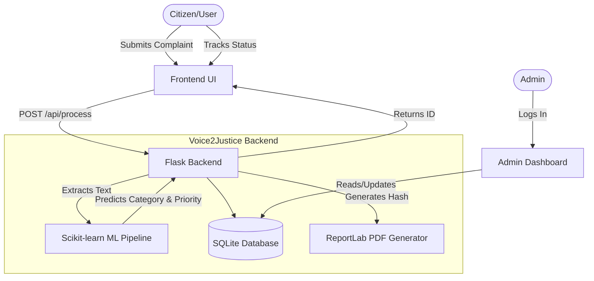

# Voice2Justice ⚖️

An automated citizen grievance intelligence platform. Voice2Justice leverages Machine Learning to automatically categorize, route, and manage citizen complaints, providing a transparent tracking system and professional PDF reports.


---

## 📸 Screenshots

| Citizen Portal | Admin Dashboard |
|---|---|
|  |  |
| **PDF Report Example** | **Complaint Tracking** |
|  |  |

---

## 🏗️ Architecture



---

## ✨ Features

- **AI-Powered Routing**: Automatically classifies complaints into 13 distinct categories (e.g., Theft, Fraud, Noise Pollution).
- **Automated Summarization**: Extracts key entities (locations, dates) and builds a structured summary.
- **Real-Time Tracking**: Citizens receive a secure tracking ID to monitor their complaint status.
- **Professional PDF Generation**: Instantly generates branded, verifiable PDF reports with QR codes and SHA-256 integrity hashes.
- **Admin Analytics Dashboard**: Secure dashboard featuring Chart.js analytics, status tracking, and quick PDF downloads.
- **Production Hardened**: Built-in rate limiting, request logging, and secure HTTP headers.

---

## 🚀 Quick Start (Local Development)

### 1. Clone the repository
```bash
git clone https://github.com/yourusername/Voice2Justice.git
cd Voice2Justice/flask
```

### 2. Create a virtual environment (optional but recommended)
```bash
python -m venv venv
# Windows:
venv\Scripts\activate
# macOS/Linux:
source venv/bin/activate
```

### 3. Install dependencies
```bash
pip install -r requirements.txt
```

### 4. Setup Environment Variables
Create a `.env` file based on the example:
```bash
cp .env.example .env
```
*(Edit `.env` to add your specific secrets and email credentials if testing the email system)*

### 5. Run the server
```bash
python app.py
```
Visit `http://127.0.0.1:5000` in your browser.

---

## ☁️ Cloud Deployment

Voice2Justice is configured for easy deployment on **Render** or **Railway**.

### Deploying to Render
1. Connect your GitHub repository to Render.
2. Create a new **Web Service**.
3. Render will automatically detect the `render.yaml` file and configure the build/start commands.
4. Ensure the root directory is set to `flask` (or deploy directly from the `flask` folder).

**Manual Settings:**
- **Build Command:** `pip install -r requirements.txt`
- **Start Command:** `gunicorn app:app`

---

## 📖 API Documentation

### `POST /api/process`
Submits a new complaint for AI classification.
- **Body:** `{ "text": "Stolen bicycle...", "location": "Central Park" }`
- **Response:** JSON containing the assigned `complaint_id`, `category`, and `priority`.

### `GET /api/track/<id>`
Fetches the current status of a complaint.
- **Response:** JSON containing the timeline, status, and department.

### `GET /report/<id>/pdf`
Generates and downloads the official PDF report.

---

## 📄 License

This project is licensed under the MIT License - see the [LICENSE](LICENSE) file for details.
