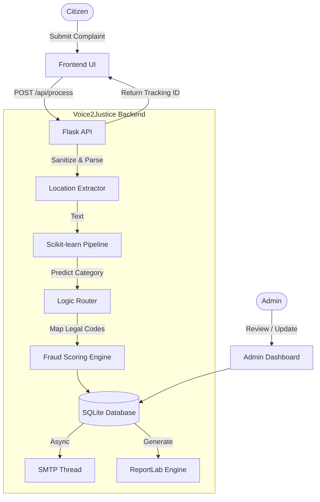

  # Voice2Justice ⚖️
  
  **AI-Powered Citizen Grievance Intelligence & Governance Routing Platform**
  
  Transforming unstructured citizen narratives into structured, actionable governance workflows instantly.

  [](https://python.org)
  [](https://flask.palletsprojects.com/)
  [](https://scikit-learn.org/)
  [](https://sqlite.org/)
  [](LICENSE)
  [](https://voice2justicee.onrender.com)

  [**Live Demo**](https://voice2justicee.onrender.com) • 
  [**System Architecture**](docs/SYSTEM_ARCHITECTURE.md) • 
  [**API Docs**](docs/API_DOCUMENTATION.md) • 
  [**Database Schema**](docs/DATABASE_SCHEMA.md)

</div>

---

## 📖 What is Voice2Justice?

Voice2Justice is a full-stack, AI-powered citizen grievance platform designed to bridge the gap between civilians and government authorities. It uses Natural Language Processing and Machine Learning to automatically classify unstructured civilian complaints into 13 distinct legal and civic categories, mapping them to specific penal codes (e.g., BNS Sections) or municipal regulations. The platform generates verifiable PDF reports, flags suspicious behavior through a multi-signal fraud scoring system, and routes actionable intelligence to the correct authorities.

## 🚨 The Problem
**Delayed Justice & Bureaucratic Bottlenecks**
Citizens often submit unstructured, emotionally charged, and vague complaints. Authorities, on the other hand, require specific formats, legal categorizations, and structured data to take action. This mismatch results in manual classification bottlenecks, misrouted grievances, and ultimately, delayed justice.

## 💡 The Solution
Voice2Justice acts as an intelligent intermediary:
1. **Citizens** describe their issues in natural language.
2. **AI** extracts key entities (location, entities), classifies the issue (e.g., Theft, Water Supply), and maps it to appropriate legal/civic codes.
3. **Authorities** receive a structured, prioritized report (FIR draft or Civic Ticket) with an AI-generated summary, ready for immediate action.

---

## ✨ Key Features

### 🧠 Artificial Intelligence
- **Smart Classification**: Scikit-learn based TF-IDF + Multinomial Naive Bayes pipeline classifies complaints into 7 crime and 6 civic categories.
- **Entity Extraction**: Automatically extracts street-level locations from unstructured text using Regex-based NLP.
- **Auto-Summarization**: Generates concise, professional summaries for authorities based on category and narrative.

### 🛡️ Security & Fraud Prevention
- **Behavioral Fraud Scoring**: Multi-signal scoring engine flags suspicious submissions (checks IP frequency, user velocity, duplicate texts, and ML confidence).
- **Dual Authentication**: Google OAuth 2.0 (via Authlib) + Local Auth for citizens; secure session-based auth for administrators.
- **IDOR Prevention**: Uses cryptographically secure UUIDv4s for all public tracking links to prevent data enumeration.
- **Hardened Security**: Built-in rate limiting (Flask-Limiter), XSS protection, HSTS, and CSP headers. 

### 📊 Admin & Reporting
- **Automated PDF Generation**: Uses ReportLab to generate professional, branded First Information Reports (FIRs) and Civic Tickets with QR tracking codes.
- **Document Integrity**: Implements SHA-256 cryptographic hashing to ensure PDF report integrity.
- **Analytics Dashboard**: Secured portal featuring Chart.js analytics for trend analysis, category distribution, and fraud status monitoring.
- **Background Email Routing**: Asynchronous email delivery (SMTP via daemon threads) ensures non-blocking request handling.

---

## 🛠️ Technology Stack

| Category | Technologies |
|----------|--------------|
| **Backend** | Python 3.12, Flask 3.1, Werkzeug |
| **Machine Learning** | Scikit-learn, NumPy, TF-IDF Vectorization, Multinomial Naive Bayes |
| **Database** | SQLite3 (Auto-migrating schema) |
| **Authentication** | Authlib (Google OAuth 2.0 OIDC), PBKDF2 Password Hashing |
| **Frontend** | HTML5, CSS3, Vanilla JS, Bootstrap 5, Chart.js, html2pdf.js |
| **Document Gen** | ReportLab, qrcode[pil] |
| **Deployment** | Render, Gunicorn (gthread), python-dotenv |

---

## 📸 Screenshots

| Citizen Portal | Admin Analytics Dashboard |
|:---:|:---:|
|  |  |
| **PDF Report Generation** | **Fraud Detection System** |
|  |  |


---

## 🏗️ System Architecture


*For a detailed architectural deep-dive, see [SYSTEM_ARCHITECTURE.md](docs/SYSTEM_ARCHITECTURE.md).*

---

## 🚀 Quick Start (Local Development)

### 1. Clone the repository
```bash
git clone https://github.com/ch-chandana/Voice2Justice.git
cd Voice2Justice/flask
```

### 2. Set up virtual environment
```bash
python -m venv venv
# Windows:
venv\Scripts\activate
# macOS/Linux:
source venv/bin/activate
```

### 3. Install dependencies
```bash
pip install -r requirements.txt
```

### 4. Configure Environment
```bash
cp .env.example .env
```
*Edit `.env` to add your specific secrets, email credentials, and Google OAuth keys.*

### 5. Run the application
```bash
python app.py
```
Visit `http://127.0.0.1:5000` in your browser. Default admin credentials are `admin` / `admin123`.

---

## 📚 Documentation Directory

- [**System Architecture**](docs/SYSTEM_ARCHITECTURE.md) - Deep dive into request lifecycles, service layers, and ML integration.
- [**Database Schema**](docs/DATABASE_SCHEMA.md) - ER diagrams, tables, migrations, and indexing strategies.
- [**API Documentation**](docs/API_DOCUMENTATION.md) - Complete REST API reference with request/response payloads.
- [**Deployment Guide**](docs/DEPLOYMENT_GUIDE.md) - Instructions for deploying to Render or similar PaaS providers.
- [**Security Overview**](SECURITY.md) - Details on rate limiting, XSS prevention, HSTS, and password hashing.
- [**Project Overview for Recruiters**](docs/PROJECT_OVERVIEW.md) - High-level summary of engineering challenges solved.

---

## 📈 Future Enhancements
- **Multi-lingual Support**: Add NLP translation layer to support regional languages.
- **PostgreSQL Migration**: Transition from SQLite to PostgreSQL for horizontal scaling in production.
- **LLM Integration**: Augment the Naive Bayes classifier with an LLM for deeper entity extraction (weapons, vehicle plates).
- **Geospatial Analytics**: Integrate PostGIS for heatmapping high-crime or low-civic-maintenance areas.

---

## 📄 License
This project is licensed under the MIT License - see the [LICENSE](LICENSE) file for details.

## 👨‍💻 Authors
**Chettipally Chandana**
- GitHub: [@ch-chandana](https://github.com/ch-chandana)
- LinkedIn: [LinkedIn Profile](https://www.linkedin.com/in/chettipally-chandana-415032353/)

**Ravalkol Meghana**
- GitHub: [@Meghana-Ravalkol](https://github.com/Meghana-Ravalkol )
- LinkedIn: [LinkedIn Profile](https://www.linkedin.com/in/ravalkol-meghana-aaab6b311/)

**Rebba Pranitha**
- GitHub: [@pranitha-r](https://github.com/pranitha-r))
- LinkedIn: [LinkedIn Profile](https://www.linkedin.com/in/rebba-pranitha-1b6b37314/)


