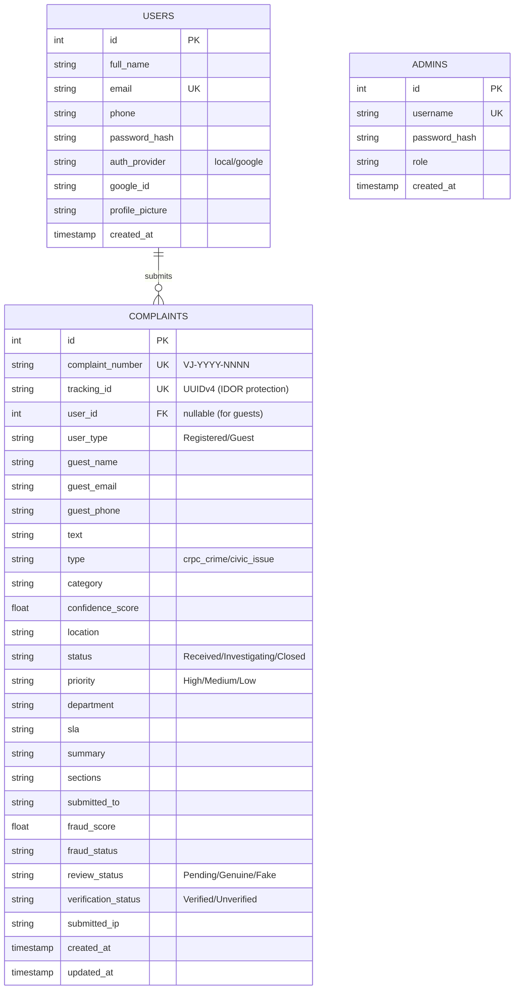

# Database Schema

Voice2Justice utilizes **SQLite3** for its relational database. The schema is auto-migrated on startup via `models/db.py`, utilizing parameterized queries to prevent SQL injection.

## Entity Relationship Diagram



## Tables & Indexing

### 1. `complaints`
The core table storing all grievance data.
- **Indexes**: `idx_complaint_number` (UNIQUE), `idx_tracking_id` (UNIQUE), `idx_status`, `idx_category`, `idx_created_at`, `idx_user_id`.
- **Fraud Tracking**: Stores `submitted_ip`, `fraud_score`, `fraud_status`, and admin `review_status` without actively blocking the user (to avoid rejecting legitimate urgent grievances).
- **Timestamps**: Uses `updated_at` for caching logic in PDF generation.

### 2. `users`
Stores citizen credentials and OAuth linkage.
- **OAuth Linkage**: `auth_provider` defaults to `local`. If authenticated via Google, stores `google_id` and `profile_picture`.
- **Constraint**: `email` is UNIQUE.

### 3. `admins`
Stores backend dashboard users.
- **Default Seeding**: `models/db.py` automatically injects a `super_admin` (`admin` / `admin123`) if the table is empty upon initialization.

## Auto-Migration Strategy

Instead of using heavy tools like Alembic, the system uses a robust, lightweight try/except migration script for SQLite.

```python
migrations = [
    "ALTER TABLE complaints ADD COLUMN user_id INTEGER",
    "ALTER TABLE complaints ADD COLUMN fraud_score REAL DEFAULT 0.0"
]
for migration in migrations:
    try:
        cursor.execute(migration)
    except sqlite3.OperationalError:
        pass  # Column already exists
```
This ensures zero-downtime schema evolution when deploying to ephemeral or new environments.
