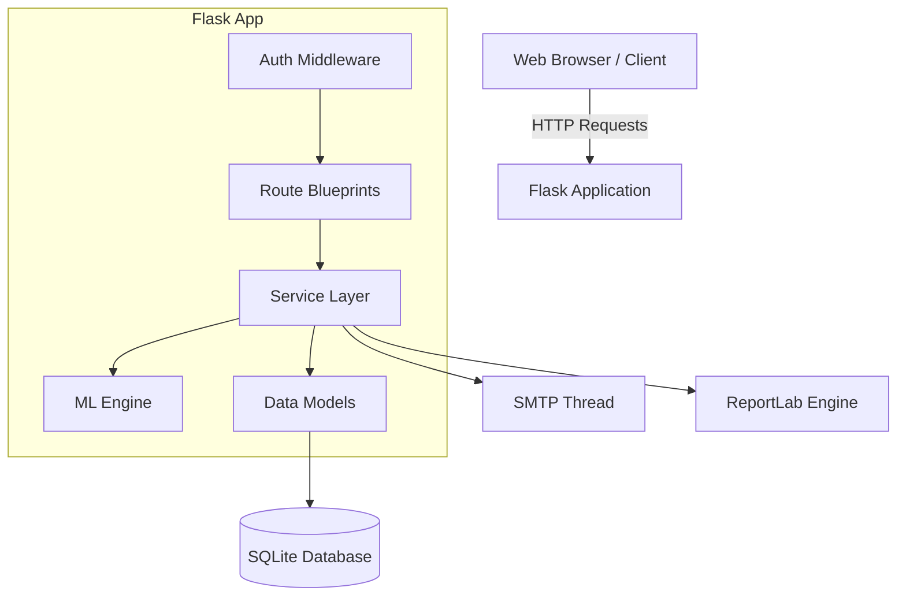

# System Architecture

Voice2Justice follows a modular, monolithic architecture built on Flask. The system is designed to separate concerns between routing, business logic, data access, and background processing.

## High-Level Architecture

## Component Breakdown

### 1. Application Entry & Config (`app.py`, `config.py`, `extensions.py`)
- **`app.py`**: The central entry point. Initializes Flask, registers blueprints, configures error handlers (404, 500, 429), and sets up security headers (HSTS, CSP).
- **`config.py`**: Manages environment variables and shared configurations (e.g., `DB_PATH`).
- **`extensions.py`**: Avoids circular imports by instantiating Flask-Limiter and Authlib OAuth instances globally.

### 2. Route Blueprints (`routes/`)
The routing layer is split into specialized blueprints to maintain clean URL ownership:
- **`complaints.py`**: Core logic for `/api/process` (submission), `/api/complaints` (listing), and `/api/track/<id>`.
- **`auth.py`**: Admin authentication (`/login`, `/logout`).
- **`user_auth.py`**: Citizen authentication (`/user/register`, `/user/login`, `/user/login/google`).
- **`dashboard.py`**: Admin analytics APIs (`/api/dashboard/stats`, `/api/dashboard/trends`).
- **`reports.py`**: HTML and PDF report generation endpoints.
- **`status.py`**: Complaint status update endpoint.

### 3. Service Layer (`services/`)
Decouples heavy business logic from the HTTP request-response cycle.
- **`classifier.py`**: Manages the dual-tier classification system (ML-first with a keyword fallback). Handles entity extraction and mapping to legal/municipal codes.
- **`email_service.py`**: Spawns daemon threads for non-blocking SMTP email delivery, crucial for preventing timeouts on single-worker deployments (like Render free tier).
- **`pdf_service.py`**: Generates branded PDF reports using ReportLab. Implements file caching based on SQLite `updated_at` timestamps to save CPU cycles.

### 4. Data Models (`models/`)
Encapsulates all database interactions.
- **`db.py`**: Handles initialization and automatic migrations (via `ALTER TABLE` try/except blocks).
- **`complaint.py`**, **`user.py`**, **`admin.py`**: Execute parameterized SQL queries, preventing SQL injection. Contains complex analytical queries (e.g., `get_dashboard_stats()`).

### 5. Machine Learning Engine (`ml/`)
- **Pipeline**: Scikit-learn Pipeline combining a `TfidfVectorizer` (with bigrams and sublinear TF) and a `MultinomialNB` classifier.
- **Data**: Trained on ~275 manually curated samples across 13 distinct Indian legal and civic categories.
- **Persistence**: Pickled to disk (`saved_models/`) and loaded into memory as a singleton at application startup.

## Request Lifecycle (Example: Complaint Submission)

1. **Client** sends POST to `/api/process` with JSON payload.
2. **Flask-Limiter** verifies the request does not exceed the 5/min limit.
3. **Route** extracts text and sanitizes it using `markupsafe.escape()`.
4. **Classifier Service** extracts location via regex and predicts category via the ML pipeline.
5. **Fraud Engine** calculates a behavior score (0.0 - 1.0) based on recent IP velocity, user velocity, and ML confidence.
6. **Data Model** saves the complaint to SQLite, generating a cryptographically secure UUIDv4 tracking ID to prevent IDOR attacks.
7. **Email Service** is triggered in a detached daemon thread.
8. **Client** receives a 200 OK JSON response containing the tracking ID and categorized data.
